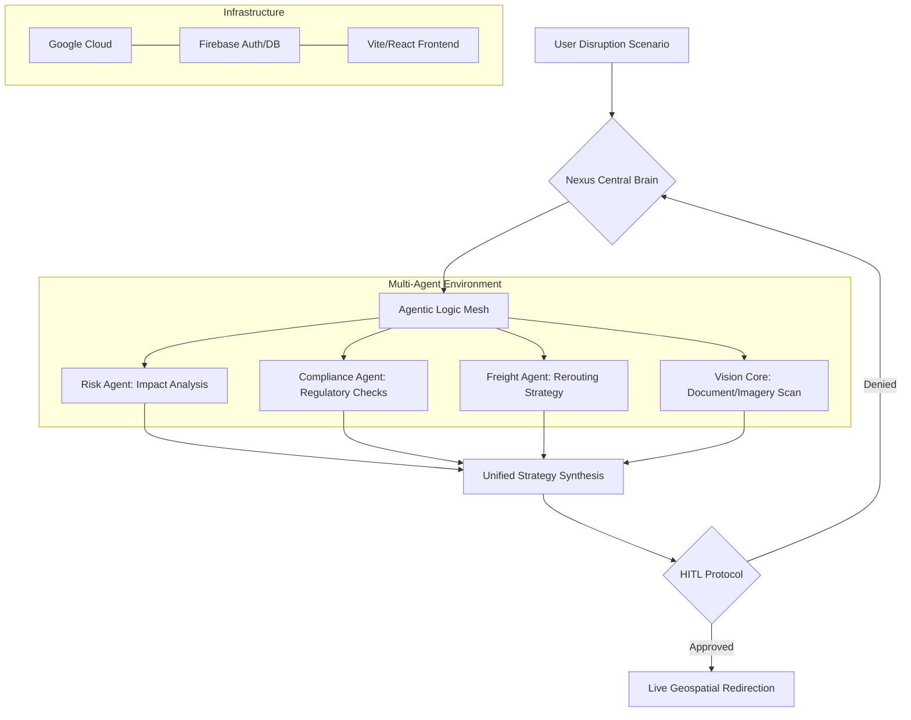

# Nexus Transit: Autonomous Logistics OS

Nexus Transit is an AI-powered logistics orchestration platform designed to handle global supply chain disruptions autonomously. By leveraging a multi-agent system powered by Gemini 1.5 Pro, it translates complex disruption scenarios into validated rerouting strategies.

## 🏗 Architecture Diagram



## 🔄 Service Flow

1.  **Input Pulse:** The user (Commander) enters a scenario (e.g., Strike, Natural Disaster).
2.  **Neural Link Initialization:** The system initializes 6 specialized agents.
3.  **Cross-Agent Debate:** Agents negotiate the best "Path of Least Resistance."
4.  **Vision Verification:** If images are provided (Manifests/Bills of Lading), Vision Core extracts critical identifiers.
5.  **Grounding:** The system provides real-time [longitude, latitude] updates for the map.
6.  **Human Overide (HITL):** Critical financial or legal decisions are presented to the user.
7.  **Resolution:** Final summary reports are generated with predictive self-healing strategies.

## 🚀 Running Instructions

### 1. Prerequisites
- Node.js (v18 or higher)
- Google Cloud Project with Gemini API access.
- Firebase Project.

### 2. Installation
```bash
# Clone the repository (if applicable)
# git clone <repo-url>

# Install dependencies
npm install
```

### 3. Environment Setup
Create a `.env` file in the root:
```env
GEMINI_API_KEY=your_gemini_api_key
VITE_FIREBASE_API_KEY=your_key
VITE_FIREBASE_AUTH_DOMAIN=your_domain
VITE_FIREBASE_PROJECT_ID=your_id
VITE_FIREBASE_STORAGE_BUCKET=your_bucket
VITE_FIREBASE_MESSAGING_SENDER_ID=your_sender_id
VITE_FIREBASE_APP_ID=your_app_id
```

### 4. Development
```bash
# Start the development server
npm run dev
```
The app will be available at `http://localhost:3000`.

### 5. Build
```bash
# Production build
npm run build
```

## 🛠 Tech Stack
- **AI Core:** Gemini 1.5 Pro (Multimodal)
- **Frontend:** React 18 / TypeScript / Tailwind CSS
- **Animation:** Framer Motion
- **Icons:** Lucide React
- **Database/Auth:** Firebase
- **Architecture:** Multi-Agent Orchestration (Simulated MCP)
